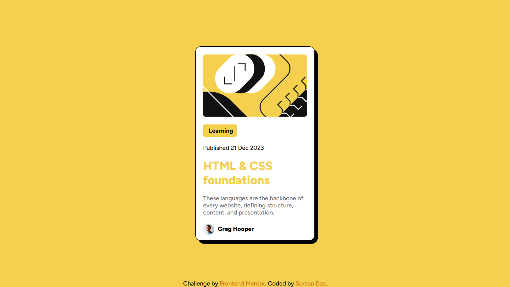

# Frontend Mentor - Blog preview card solution

This is a solution to the [Blog preview card challenge on Frontend Mentor](https://www.frontendmentor.io/challenges/blog-preview-card-ckPaj01IcS). Frontend Mentor challenges help you improve your coding skills by building realistic projects.

## Table of contents

- [Overview](#overview)
  - [The challenge](#the-challenge)
  - [Screenshot](#screenshot)
  - [Links](#links)
- [My process](#my-process)
  - [Built with](#built-with)
  - [What I learned](#what-i-learned)
  - [Continued development](#continued-development)
- [Author](#author)

## Overview

### The challenge

Users should be able to:

- See hover and focus states for all interactive elements on the page

### Screenshot

### Links

- Solution URL: [https://github.com/webdevsuman/Blog-preview-card](https://github.com/webdevsuman/Blog-preview-card)
- Live Site URL: [https://webdevsuman.github.io/Blog-preview-card](https://webdevsuman.github.io/Blog-preview-card)

## My process

I first set the HTML codes and then style it. I kept in mind using the semantic tags as much as possible. After desktop design is completed, I try to make it responsive for smaller screens.

### Built with

- Semantic HTML5 markup
- CSS custom properties
- Flexbox

### What I learned

Giving each component the right gap and alignment, that is what I have mostly learnt through this project. Changing mouse pointer on hover is another to my list.

### Continued development

I am still chasing after the secret codes to make a site responsive by default without needing to use media queries.

## Author

- Website - [Suman Das](https://github.com/webdevsuman/)
- Frontend Mentor - [@webdevsuman](https://www.frontendmentor.io/profile/webdevsuman)
